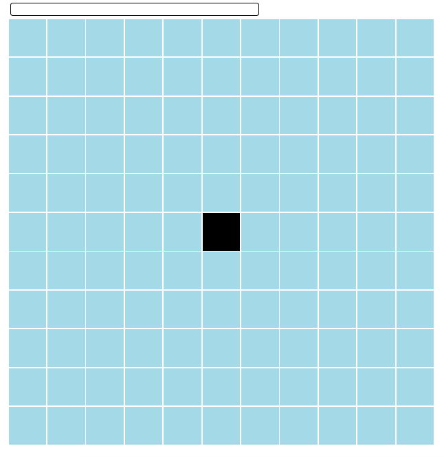
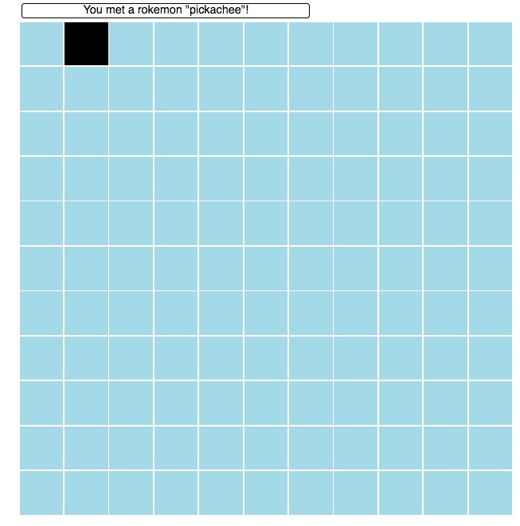

# Wild Rokemon Encounter

You will develop a game in which you can navigate around the map and meet wild Rokemons (this challenge requires you to only "meet" the Rokemons, but you are free to design functionalities such as catching, fighting or whatever you want with Rokemons of course).

Use a framework/library of your choice.

## Requirements

* Create a 11 x 11 grid where each tile represents a place that your character can stand. You need some kind of indicator to distinguish the tile that the character is standing on from other tiles, such as a different colour of tile, or if you want to be fancy, a character icon on top of the tile. They should initially be placed at the centre of the map.

* You can move the character using up, down, left and right arrow keys. If the character is at the edge of the map, a move towards the outside the map shouldn't move your character.
* You should hide some Rokemons in a random set of tiles. They should be randomly distributed across the map, so that it's impossible to predict where they are at the beginning. I recommend probability of 10% or so of placing a Rokemon at a tile. When your character goes into the tile that a Rokemon is in, a message should be displayed notifying you of that. Here is a sample Rokemon data:
`const rokemons = ['pickachee', 'roombasaur', 'fartmander', 'spurtle'];`
* 

## Demo

https://wild-rokemon-encounter.herokuapp.com/

## Suggested Steps

1. Render the 11 x 11 grid
2. Style the position of the character, and update the position when the arrow keys are pressed
3. Insert Rokemon data and display message depending on the position of the character.

## Help References
* Generating a random integer in JavaScript: https://developer.mozilla.org/en-US/docs/Web/JavaScript/Reference/Global_Objects/Math/random
* Keycode for the key pressed: http://keycode.info/