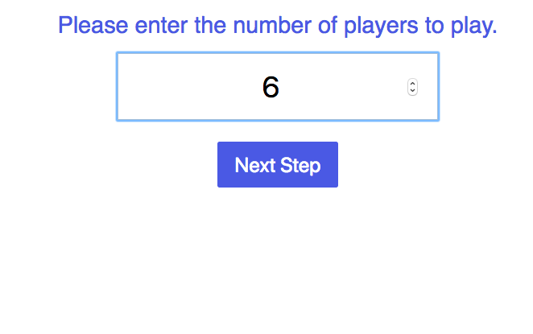
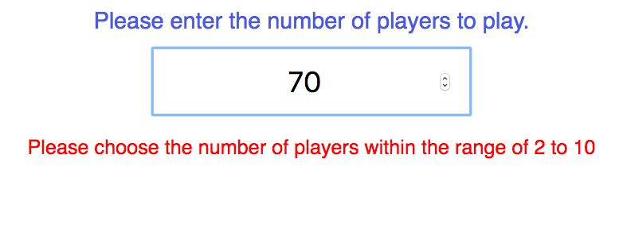
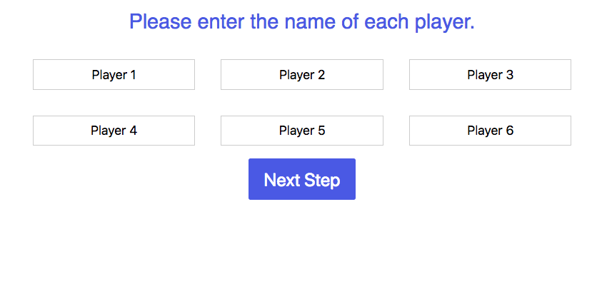
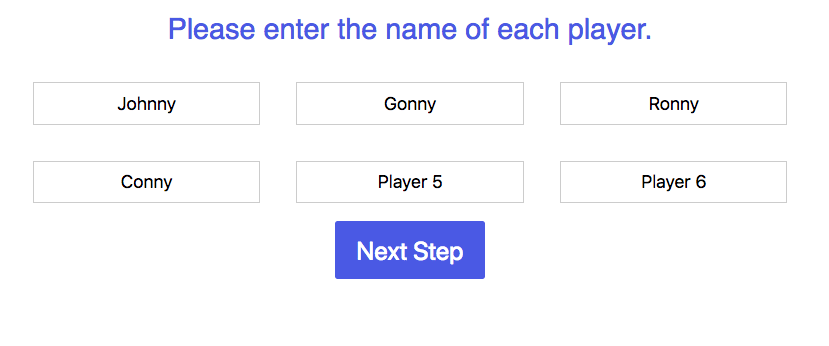
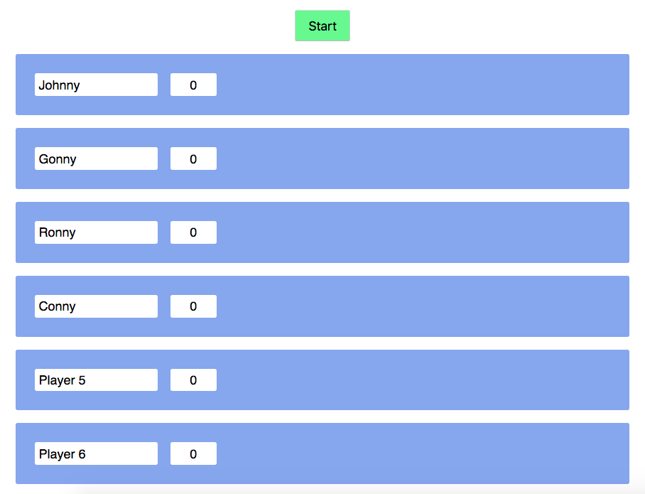
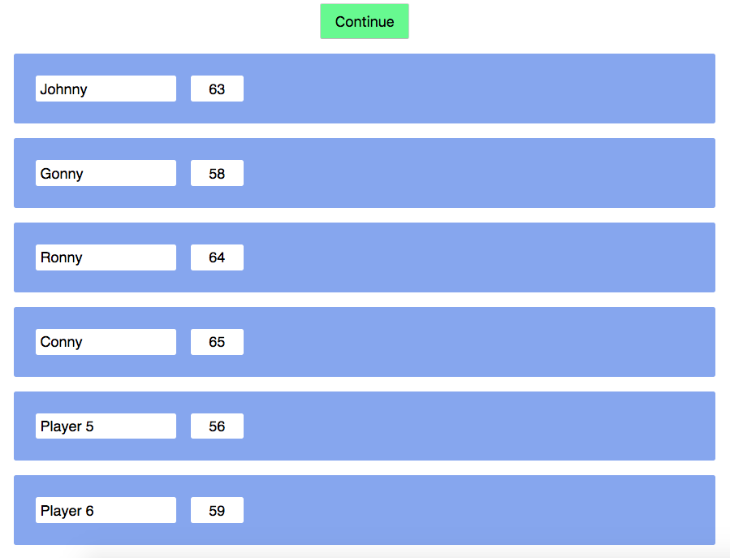
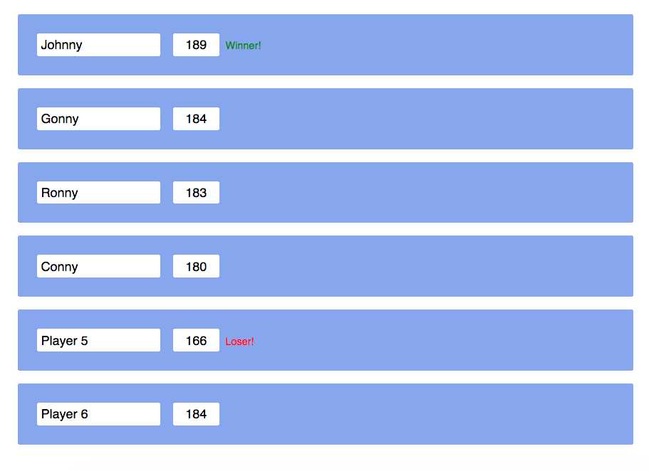

# Concurrency Horse Racing

Imagine you want to pick one among you and your friends to order extra beer. To make this process more exciting, you want to create a game that will play a horse racing and show the progress with numbers.

Use a framework/library of your choice.

Check out the demo [here](https://concurrency-horse-racing.herokuapp.com/).

## Requirements

1. When the page first loads, it should show an input field to enter the number of players to play and a button that proceeds the user to the next step. 
There should also be validation that prevents users to proceed with the number of players less than 2 or greater than 10 (either disable the button or don't show in that case). 

2. If the user goes to step 2, they will be presented with the name fields that correspond to the names of the players. The forms should be pre-filled with names `Player 1`, `Player 2`, etc. 
Users should be able to change them though. Finally there should be a button that proceeds to the final step. 

3. If the user goes to the final step, there should be a button `Start` and a number (initially 0) indicating the progress of the horse for each player. 
If the user click `Start` button, the race begins. There are 3 rounds (but each round stacks up, so it's just one game) and each round lasts 3 seconds. Each player's number increases by either 1, 2, or 3 every 0.1 second. While the race is in progress, the `Start` button should either be disabled or disappear. After 3 seconds (a round is finished), the numbers should stop increasing and the `Start` button should be changed to `Continue` button.  The next round begins if the user clicks the `Continue` button.
4. After all rounds are played, the winner and loser are announced (any form will be fine). 

Because the most important aspect of this exercise is to make you familiarize with promises, use the following function to play one round - copy the `proceedOneRound.js` file provided in this repo and use it like so:
```javascript
import proceedOneRound from './proceedOneRound';

proceedOneRound(function (value) {
  // Do something with the value (value here is the
  // random value generated every 100 milliseconds)

  // Simply log the value here
  console.log(value);
})
.then(() => {
  console.log('Done!!!');
})
```
The above code will print 30 lines of either 1, 2 or 3, one line every 0.1 second. After printing the 30 lines (so after 3 seconds), it will finally print "Done!!!".

Please go ahead and have a look in the file, to see how it is implemented. Simply using this won't require you to understand this, but it will help you understand promises in JavaScript.

## Suggested Steps

1. Craft the first page (show the form, and verify that the input entered is being kept track of).
2. Implement workflow that lets users go to the next page (name forms page), and the input entered in the first page is correctly carried over to it. I recommend using router approach to manage multiple pages, though it's probably not the easiest way (it's just for practice purpose).
3. Render the final (horse racing) page, in the initial state. It should show the correct number of forms and names of each player depending on the previous steps.
4. Implement horse racing procedure using the `proceedOneRound` function.
5. Implement winner/loser logic.

## Help References

* JavaScript Promises: https://developer.mozilla.org/en-US/docs/Web/JavaScript/Reference/Global_Objects/Promise
* `Promise.all`: https://developer.mozilla.org/en-US/docs/Web/JavaScript/Reference/Global_Objects/Promise/all
* If you're using the router approach, there are probably popular router solutions available for any tool that you use.
  * [React Router](https://reacttraining.com/react-router/);
  * [Vue Router](https://router.vuejs.org/)
  * [Routing in Angular](https://angular.io/guide/router)

